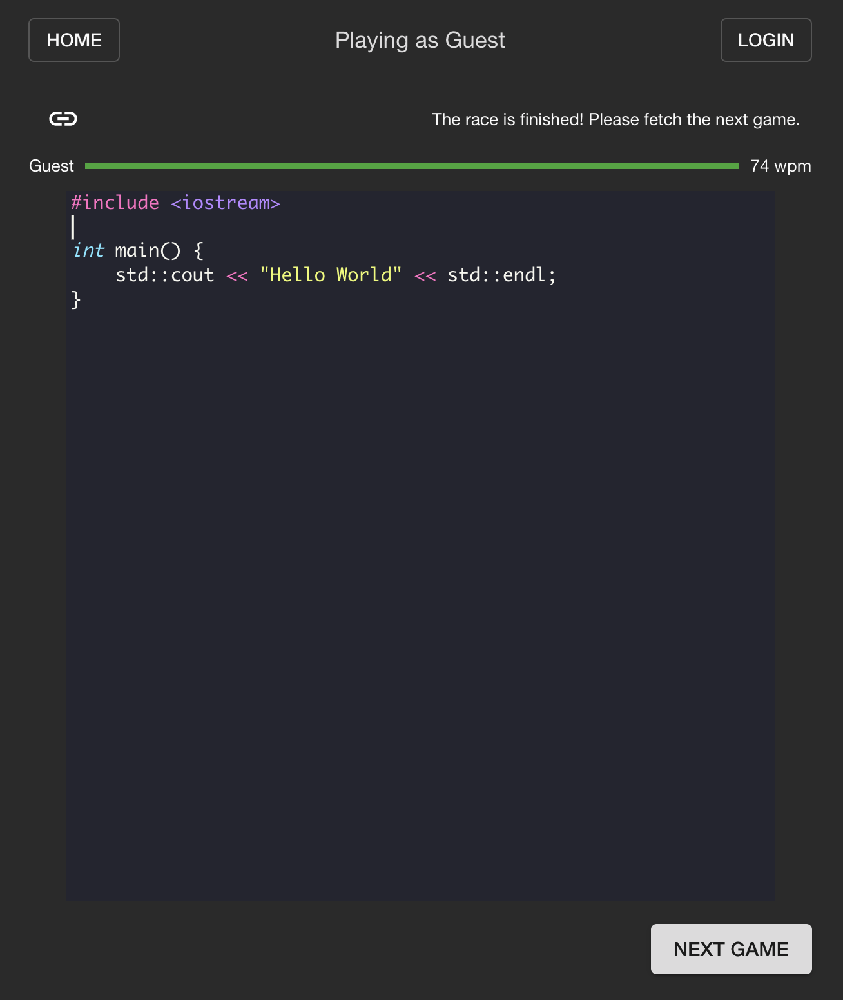

# DevRacer

DevRacer is an online typing game for developers that took inspiration from [Typeracer](https://play.typeracer.com). Type the most popular snippets in various programming languages to increase your typing speed! It is currently live and you can check it out [here](https://hujoseph99.github.io/devracer).

	

This game was created using React on the frontend, Go on the backend, and MongoDB as the database. Unfortunately, you will not be able to run this locally as it requires some sensitive secret keys, but be sure to check out the live game!

### Todos

This game is still in development and the version deployed is a very small part of what I envision the end result to be. Here are some other features that I intend to add in:

- Multiplayer queue with matchmaking
- Allow users to upload custom snippets
- Practice mode
- Replays
